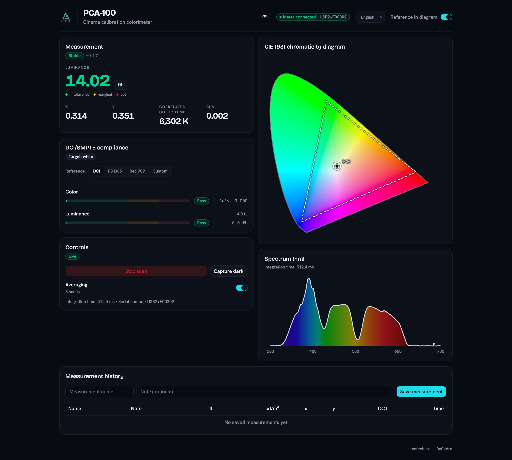
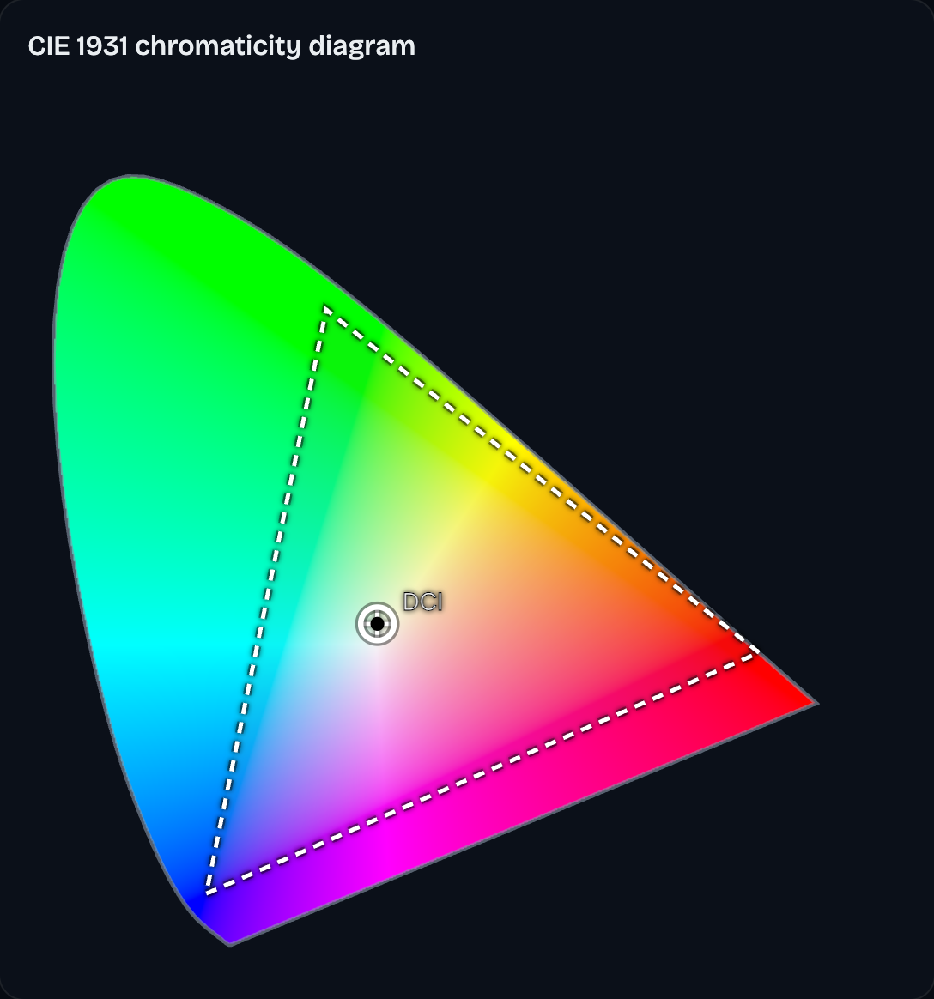
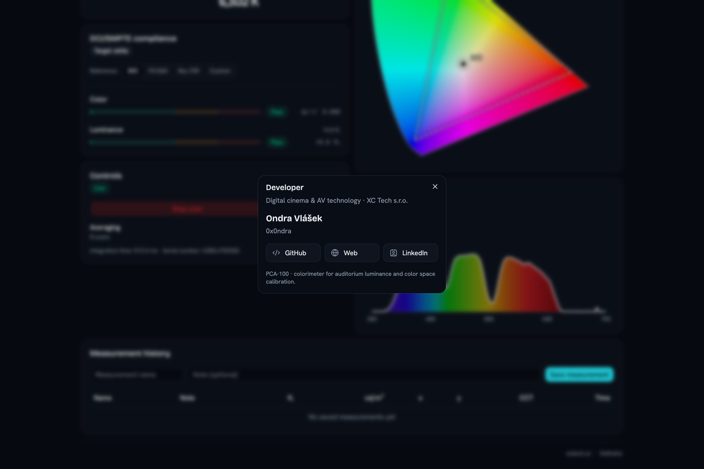

# PCA-100 Measurement Software for macOS

A macOS spot meter for digital cinema projector calibration. It reads luminance, CIE 1931 x/y chromaticity and CCT from the screen with an Ocean Optics USB2000+ spectrometer and checks DCI / SMPTE RP 431-2 compliance.

[](https://github.com/0x0ndra/pca100/actions/workflows/ci.yml)
[](LICENSE)
[](https://github.com/0x0ndra/pca100/releases)

| Dashboard | CIE 1931 diagram | Developer modal |
|---|---|---|
|  |  |  |

## What it is

PCA-100 drives an Ocean Optics USB2000+ spectrometer to measure luminance, CIE 1931 chromaticity and correlated color temperature off a cinema screen, then evaluates the result against DCI / SMPTE RP 431-2 tolerances (white point, primaries, luminance). A modern replacement for the Windows-only USL PCA-100 software. Not affiliated with or endorsed by USL / QSC.

## Features

- **Live measurement**: luminance (ft-L / cd/m² toggle), x/y chromaticity, CCT, ΔUV (deviation from the black-body curve), with switchable scan averaging and a measurement stability indicator (Settling / Fluctuating / Stable).
- **CIE 1931 chromaticity diagram** with a colored spectral fill, an overlay of the selected reference (white point + gamut triangle: DCI / P3-D65 / Rec.709 / custom) and the live measured point.
- **Live spectrum** with a wavelength-based color palette, scaled to the visible band's maximum (380-780 nm; the spectrometer returns the full grid, ~340-1030 nm, and near-IR would otherwise flatten the visible part).
- **DCI/SMPTE compliance**: auto-detects the nearest target and evaluates tolerances per SMPTE RP 431-2:2011. Reference is selectable: DCI / P3-D65 / Rec.709 / custom (white point + luminance + primaries). White is evaluated via Δu'v' ≤ 0.006, primaries via x,y tolerance boxes, luminance 14 fL ±2 fL. The headline luminance number is color-coded (green / yellow / red) with a legend.
- **Measurement history** with date, time and an optional note; kept across restarts, exportable to CSV (saved to Downloads). Values in the app can be selected and copied.
- **Language switcher (EN/Czech)**: dictionary and formatting in `lib/strings.ts` / `lib/lang.ts`, including number and date formatting, extensible to further languages.
- **Instrument connection indicator** in the header (connected / disconnected) with automatic reconnect after a USB disconnect. The last error propagates to `/api/status` and shows in the badge tooltip, so "disconnected" doesn't hide a different underlying cause.
- **Runtime dark**: "Measure dark" / "Clear dark" (state held by the backend in `dark_active`, an active dark is highlighted in the UI) and Scan On/Off.

Localization currently covers the measurement dashboard; onboarding and system dialogs are English only.

## Requirements

- A USL PCA-100 unit (Ocean Optics USB2000+ spectrometer inside).
- macOS on Apple Silicon.

## Install

Download the signed, notarized DMG from [Releases](https://github.com/0x0ndra/pca100/releases), open it, drag `PCA-100` into Applications, and launch it. On first launch, complete the calibration setup described below.

## First-run calibration

The app needs calibration files for your specific instrument before it will produce readings. See [Calibration](docs/calibration.md) for what's required and where to put it.

## Build from source

```
(cd backend && uv sync)
(cd frontend && npm install)
make dev
```

`make dev` runs the backend (uvicorn on `http://localhost:8320`) and the frontend (Vite dev server on `http://localhost:5175`, proxying `/api` to the backend) concurrently. The packaged `.app`/DMG is built from `packaging/build_app.sh` (PyInstaller bundle, code signing, notarization, DMG creation); see `packaging/README.md` for the full packaging flow.

## Architecture

The backend is layered (enforced by import-linter), each module with one responsibility:

```
device      seabreeze wrapper (USB2000+), fake for tests
netguard    allow-list origin (same layer as device)
  -> calibration   per-unit calibration parsers + dark model
  -> pipeline      raw -> dark -> boxcar -> lamp -> radiance, grid guard
  -> colorimetry   spectrum -> XYZ -> x, y, luminance, CCT (colour-science)
  -> agc           auto integration time, saturation detection
  -> engine        measurement loop, averaging, scan/dark state, reconnect
  -> api           FastAPI REST + WebSocket (JSON), origin guard
```

`desktop/app.py` is a native macOS shell: it runs the FastAPI backend in a background thread and opens it in a native window via `pywebview` instead of a browser tab. This is what gets packaged into the DMG by PyInstaller.

Frontend: React 19 + Tailwind 4 + shadcn/ui, hooks separated from components, colorimetry and DCI logic live in `src/lib/` with no UI dependency.

### Network

The backend listens on port 8320 by default (`PCA_PORT`). There is no authentication: anyone who can reach the API can start or stop scans and read live measurements.

By default the app is local-only: the socket binds loopback and nothing on the network can reach it. Remote access is an in-app toggle, off by default and persisted across launches. Turning it on rebinds the socket to `0.0.0.0` and shows a connect URL plus a QR code for the machine's LAN address; turning it off rebinds back to loopback. The toggle takes effect at runtime, with no restart, and the desktop window itself always stays on loopback regardless of the setting. `PCA_HOST` still overrides the bind address for the `python -m pca.main` dev entry point.

That live rebind is a packaged-app behavior (the desktop `ServerSupervisor` swaps the socket in place); for the `python -m pca.main` dev entry point the bind address is resolved once at startup, so the guard policy updates live but the socket itself only moves on the next restart.

With remote access on, anyone on that network can view and control the meter (start or stop a scan, capture or clear dark, reload calibration): there is no login and no per-client permission.

The `netguard` module enforces this at the request level:

- Browser Origin is allow-listed to loopback and private/LAN IP addresses only. DNS names (other than `localhost`) are never trusted, no matter how local-sounding the name is: an attacker who controls a name could repoint it at the operator's machine after the browser's same-origin check already passed.
- A Host-header check runs on every request (HTTP and the `/api/live` WebSocket), independent of Origin, which closes DNS-rebinding attacks that an Origin-only check would miss.
- A client that sends no Origin header at all, such as curl or a native app, is allowed through for a Host the guard accepts, since no hostile web page can act as that kind of client.

Every state-changing endpoint is gated by this guard: `POST /api/scan/start`, `POST /api/scan/stop`, `POST /api/averaging`, `POST /api/dark`, `DELETE /api/dark`, `POST /api/calibration/reload`, `POST /api/calibration/reveal`, `POST /api/remote-access`, `POST /api/update/download`.

### Updates

On startup the app checks GitHub Releases for a newer version and, if one is available, offers a one-click download of the signed DMG. The only outbound network call this makes is to the GitHub API. Opt out by setting `PCA_NO_UPDATE_CHECK=1`.

## Calibration & accuracy

The reference instrument was calibrated side-by-side against the original USL software. See [Validation protocol](docs/validation-protocol.md) for methodology, results and known deviations.

## DCI suitability

See [DCI suitability and limits](docs/dci-suitability.md) for what the tool can do for DCI calibration and where its limits are (traceable calibration, RGB laser).

## Status

The application is under active development and is in production use on the author's
own instrument. If you have a PCA-100 of your own, the most useful thing you can do is
run a comparison measurement in a real auditorium: take the same readings with the
original USL software and with this application, under the same conditions, and see
whether they agree.

If they do not, please [open an issue](https://github.com/0x0ndra/pca100/issues) with
the readings from both applications, your unit number and the projector type (xenon,
laser phosphor or RGB laser). See [Validation protocol](docs/validation-protocol.md)
for the methodology used on the reference instrument. Pull requests are welcome.

## Contributing

See [CONTRIBUTING.md](CONTRIBUTING.md).

## License

MIT, see [LICENSE](LICENSE).

Built by Ondra Vlášek ([0x0ndra](https://github.com/0x0ndra)), XC tech s.r.o.
